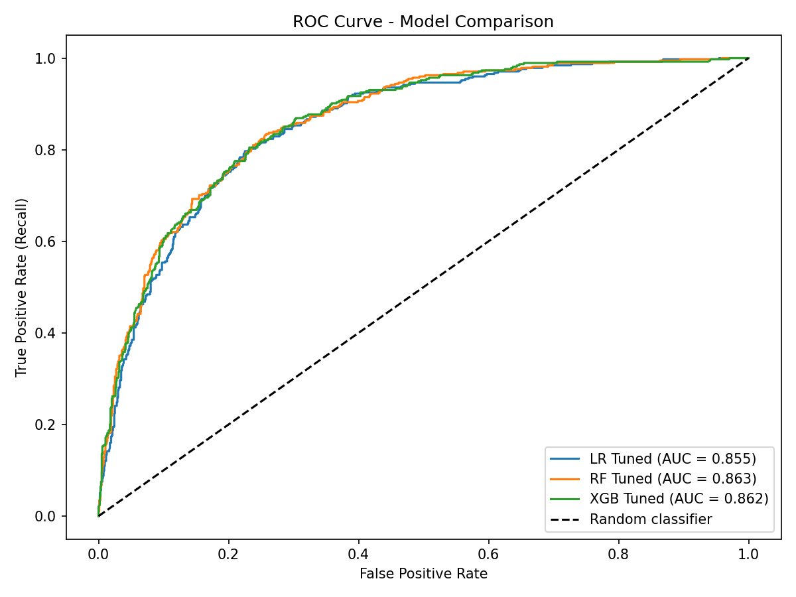

## 📌 Project Overview
This project focuses on predicting customer churn for a telecommunications company using machine learning classification models. The goal is to  identify customers at risk of cancelling
their service, enabling the business to take a proactive  retention actions.
The project consists of two phases: **Exploratory Data Analysis (EDA)** to understand the data and uncover key churn patterns, and **Model Training** where three classification models were trained 
and compared: Logistic Regression, Random Forest, XGBoost - each evaluated on default settings and tuned using GridSearchCV with F1-score optimization.

## 📊 Dataset Information
The data used in this project comes from Telco Customer Churn dataset  available on Kaggle.
* **Source:** https://www.kaggle.com/datasets/blastchar/telco-customer-churn
* **Records:** 7043 customers
* **Features:** 21 columns (20 features + 1 target variable)
* **Class imbalance:** Churn = No: 5174 (73.58 %) | Churn = Yes: 1869 (26.42 %)
> Column descriptions sourced from the official Kaggle dataset page.

## 🛠️ Tech Stack & Tools
* **Languages:** Python
* **Data Manipulation:** `pandas`
* **Data Visualization:** `matplotlib`, `seaborn`
* **Machine Learning:** `scikit-learn`, `xgboost`
* **Environment:** Jupyter Lab


## 📂 Project Architecture
The project is structured into 2 logical stages (Jupyter Notebooks).
### 1️⃣ Phase 1: Data Cleaning & EDA
File: `01_Data_Cleaning_and_EDA.ipynb`
* **Data Quality Check:** Design a custom class to identify missing values and duplicates. Handle missing values.
* **Univariate Analysis:** Analysis data to better understand distribution.
* **Bivariate  Analysis:** Relationships between features and churn target variable
* **Correlation Analysis:** Investigating relationships between numerical features and churn to select independent variables for modeling

### 2️⃣ Phase 2: Classification Models Training
File: `02_Classification_Models_Training.ipynb`
* **Preprocessing:** Applied a highly optimized hybrid encoding strategy: Label Encoding for binary features, manual numerical mapping for ordinal features (`Contract`), and One-Hot Encoding (`pd.get_dummies` with `drop_first=True`) for nominal features. Class imbalance (73/27) was addressed via StratifiedKFold cross-validation and `class_weight='balanced'` during GridSearchCV tuning.
* **Logistic Regression:** Baseline model + GridSearchCV tuning (F1 optimization)
* **Random Forest Classifier:** Baseline model + GridSearchCV tuning (F1 optimization)
* **XBGClassifier:** Baseline model + GridSearchCV tuning (F1 optimization)
* **Feature Importance:** Analysis of key churn predictors for each tuned model
* **ROC-AUC:** Comparison of all tuned models

## 📈 Results

|Model|Precision|Recall|Specificity|Accuracy|F1|ROC-AUC|FN|
|:-----|:------|:------|:--------|:-------|:------|:-----|:-----|
|LR Default|66.23 %|54.54 %|89.95 %|80.55 %|59.82 %|-|170|
|LR Tuned|54.20 %|81.02 %|75.27 %|76.79 %|64.95 %|85.47 %|71|
|RF Default|68.91 %|49.19 %|91.98%|80.62%|57.41 %|-|190|
|RF Tuned|55.70 %|78.32 %|77.49 %|77.15 %|65.11 %|86.25 %|81|
|XGB Default|64.29 %|53.35 %|88.89 %|79.99 %|58.48 %|-|167|
|XGB Tuned|54.41 %|80.75%|75.76 %|76.93 %|65.02 %|86.21 %|72|

* 🏆**Best Model: Logistic Regression Tuned**
* Highest Recall (81.02 %)
* Lowest missed churners (FN = 71)
* Comparable F1 and Precision to more complex models
* Simple, interpretable and easy to deploy



* All three tuned models achieve nearly identical ROC-AUC score (LR: 0.855, RF: 0.863, XGB: 0.862), indicating comparable discriminative ability. The final model selection was theraforce basen on Recall and FN - metrics that better reflect the business
objective of minimizing missed churners.

## 🔍 Key Findings
* **Contract type** and **Tenure** are the strongest churn predictors across all tested algorithms.

* Customers on **month-to-month** contracts are drastically more likely to leave compared to those on one- or two-year contracts.

* **The "Fiber Optic" Risk:** Proper categorical encoding revealed that customers using the **Fiber optic** internet service are at a remarkably high risk of churning, suggesting potential issues with pricing competitiveness or service quality.

* **Payment Methods Matter:** Customers using manual payment methods, specifically **Electronic check**, show a significantly higher churn rate compared to those using automated, frictionless methods (like credit cards).
## 🚀 How to Run (Local Setup)

To reproduce the analysis on your local machine, follow these steps:

**1. Clone the repository and navigate to the project directory:**
```bash
git clone https://github.com/Oliwer1992/telco-customer-churn.git
cd telco-customer-churn
```

**2. Set up a virtual environment (recommended):**
```bash
python -m venv venv
# On Windows:
venv\Scripts\activate
# On macOS/Linux:
source venv/bin/activate
```

**3. Install required dependencies:**
```bash
pip install -r requirements.txt
```

**4. Run the Jupyter Notebooks:**
Launch Jupyter Lab or Jupyter Notebook and execute the files in the following sequential order:
```bash
jupyter lab
```
* `01_Data_Cleaning_and_EDA.ipynb`  (Cleans data and generates visualizations)
* `02_Classification_Models_Training.ipynb` (Train models and evaluates performance)

> **Note:** Ensure that the raw CSV data files are placed in the correct `data/` directory.
